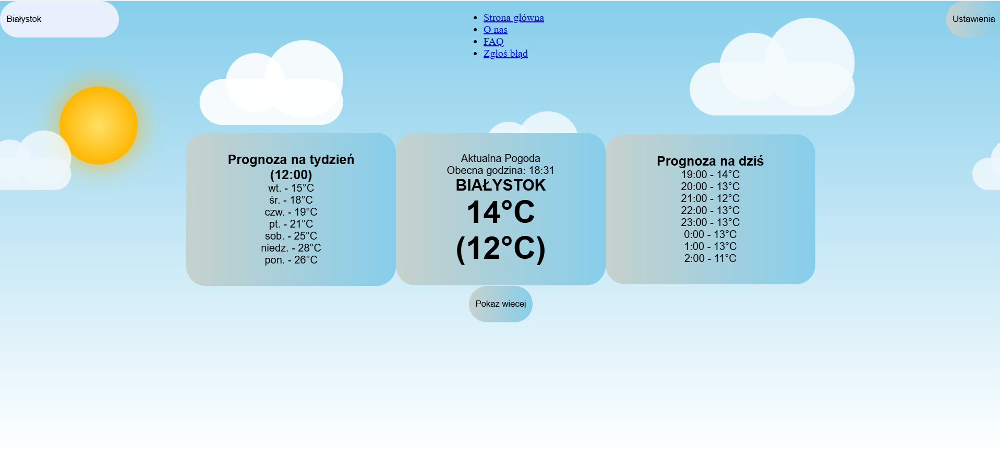
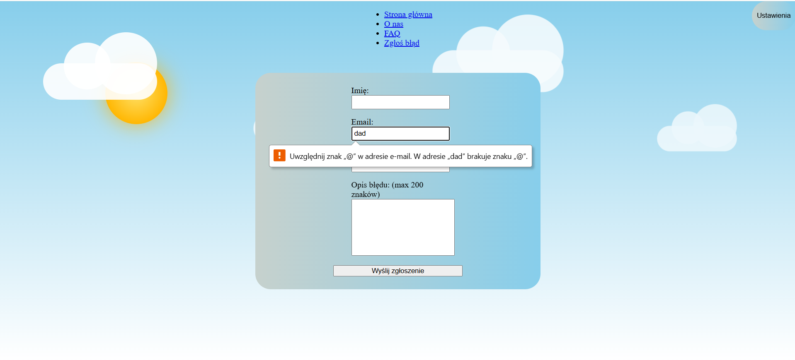
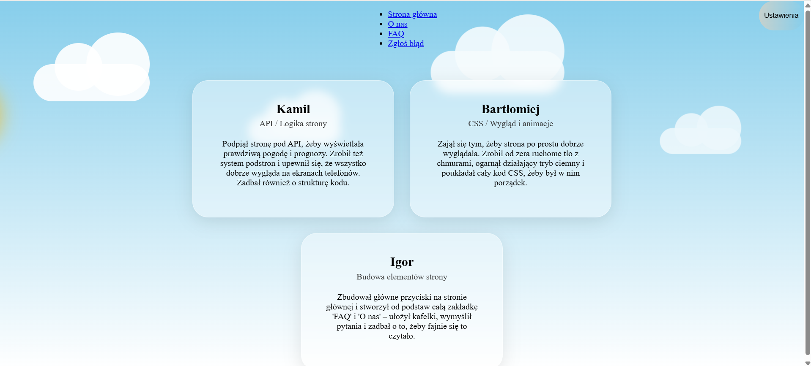
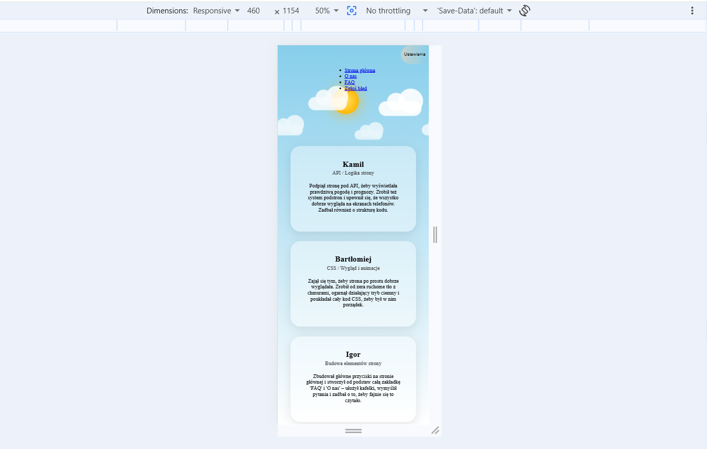
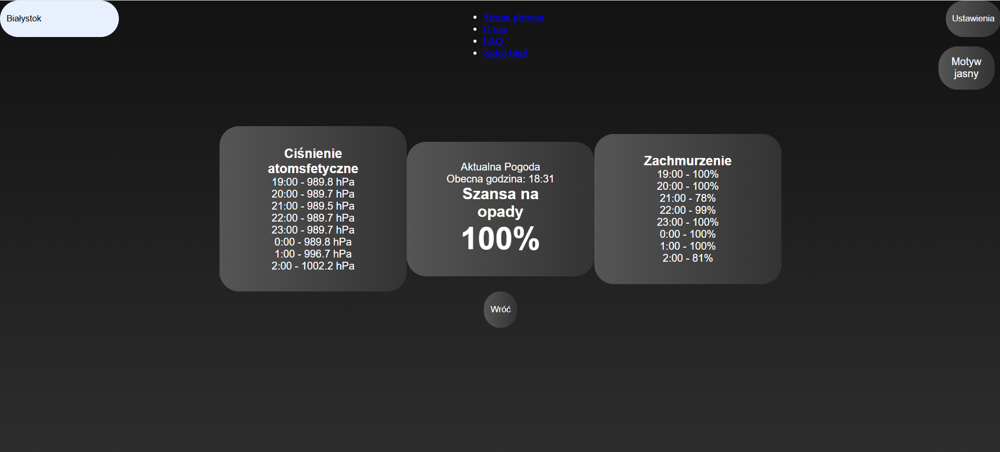

# Pogoda BIK
## Opis projektu

Pogoda BIK to prosta strona internetowa służąca do sprawdzania pogody dla wybranego miasta. Użytkownik wpisuje nazwę miasta, a strona pobiera dane pogodowe i wyświetla je w formie czytelnych bloków.

Projekt został wykonany przy użyciu HTML, CSS oraz JavaScript.

## Cel projektu

Celem projektu jest stworzenie aplikacji pogodowej działającej w przeglądarce, która pozwala szybko sprawdzić aktualną pogodę, prognozę godzinową oraz prognozę na najbliższe dni.

Projekt pokazuje również wykorzystanie zewnętrznego API do pobierania danych oraz dynamiczne tworzenie elementów strony za pomocą JavaScriptu.

## Funkcje strony

### Strona umożliwia:

- wpisanie miasta i pobranie pogody,
- wyświetlenie aktualnej temperatury,
- pokazanie temperatury odczuwalnej,
- pokazanie prognozy godzinowej,
- pokazanie prognozy na tydzień,
- sprawdzenie ciśnienia atmosferycznego,
- sprawdzenie zachmurzenia,
- pokazanie szansy na opady,
- przełączenie dodatkowych informacji przyciskiem „Pokaż więcej”,
- zmianę motywu na ciemny,
- przechodzenie między zakładkami „Strona główna”, „O nas” i „FAQ”.
## Technologie

### W projekcie użyto:

- HTML,
- CSS,
- JavaScript,
- Open-Meteo API.
### Struktura plików
- main.html – główny plik HTML strony
- main.js – elementy stron FAQ i o nas
- tlo.js - animacja chmur w tle
- pokazwiecej.js i pokaz-wiecej.js - funkcjonalność przycisku pokaż więcej
- pogoda-api.js - cala logika zwiaząna z API
- nawigacja.js - logika związana z nawigacją między stronami
- elementy.js - umieszczanie wszysktich elementów na stronie przy jej pierwszym włączeniu
- ustawienia.js - logika zmiany trybu na ciemny
- plik.css, baza.css, przyciski.css, uklad.css – pliki stylu strony głównej
- pogoda-tlo.css – animowane tło pogodowe
- podstrony.css - wyglad podstron
- dark-mode.css - tryb ciemny
- responsywnosc.css - wygląd na ekranach innych rozmiarów

## Wygląd strony

Strona posiada pogodowe tło z animowanym słońcem i chmurami. Główne informacje są pokazane w trzech dużych blokach. Projekt zawiera również tryb ciemny oraz dostosowanie wyglądu do telefonów i większych ekranów.

## Zrzuty ekranu

Poniżej zostały umieszczone najważniejsze widoki strony, pokazujące realizację założeń projektu:

**1. Widok główny (Pobieranie i wyświetlanie danych z API)**

**2. Formularz zgłoszeniowy (Walidacja danych)**

**3. Dodatkowe widoki (Zakładka O nas)**

**4. Wersja mobilna (Responsywność i mobile-first)**

**5. Rozszerzenia funkcjonalności (Tryb ciemny i dodatkowe informacje pogodowe)**

**6. Obsługa błędów (Komunikat o nieistniejącym mieście)**

## Autorzy

Projekt został wykonany przez zespół uczniów:

- Kamil Pietrewicz – API i logika strony
- Bartłomiej Kotowski – CSS, wygląd, animacje i struktura plików
- Igor Rostkowski– budowa elementów strony, FAQ i sekcja „O nas”